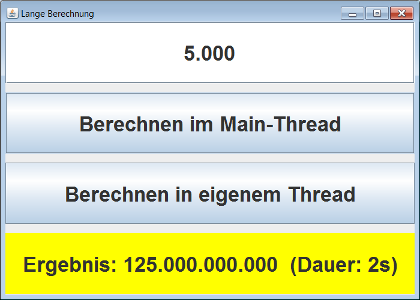

# Lange Berechnung mit Swing und JavaFX

Two Java programs (Desktop programs, no Android apps!) showing how to perform a long calculation in a background thread. 
The programs are using different UI libraries, namely [Swing](https://docs.oracle.com/javase/tutorial/uiswing/start/index.html) 
and [JavaFX](https://docs.oracle.com/javafx/2/overview/jfxpub-overview.htm).
<br>

Identifiers (names for classes, variables and methods), (JavaDoc) comments and UI texts are in German only.

<br>

----
## Compiling

Open a shell (e.g. DOS Box or Shell) in the folder with the Java file. Then enter the following command:

````
javac *.java
````

This should compile both variants of the application (namely one with *Swing* and one with *JavaFX*).

<br>

----
## Swing version


Commands to run the application:

````
java LangeBerechnungMitSwing
````

<br>



<br>

----
## JavaFX version

Commands to run the application:

````
java LangeBerechnungMitJavaFX
````

<br>


<br>

----
# License

See the [LICENSE file](LICENSE.md) for license rights and limitations (BSD 3-Clause License).

